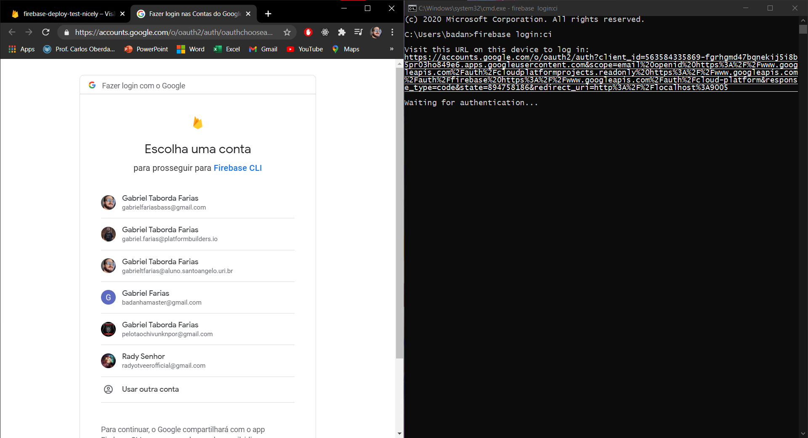
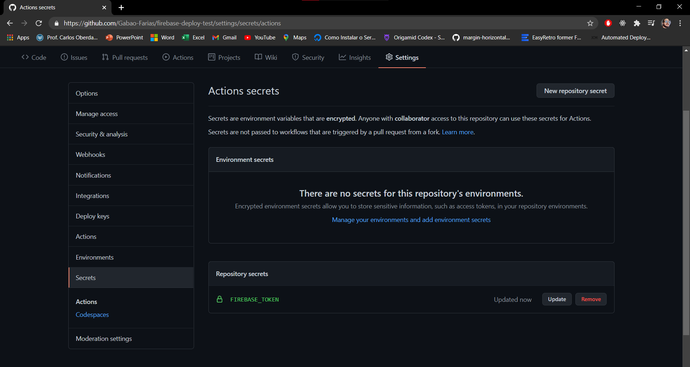
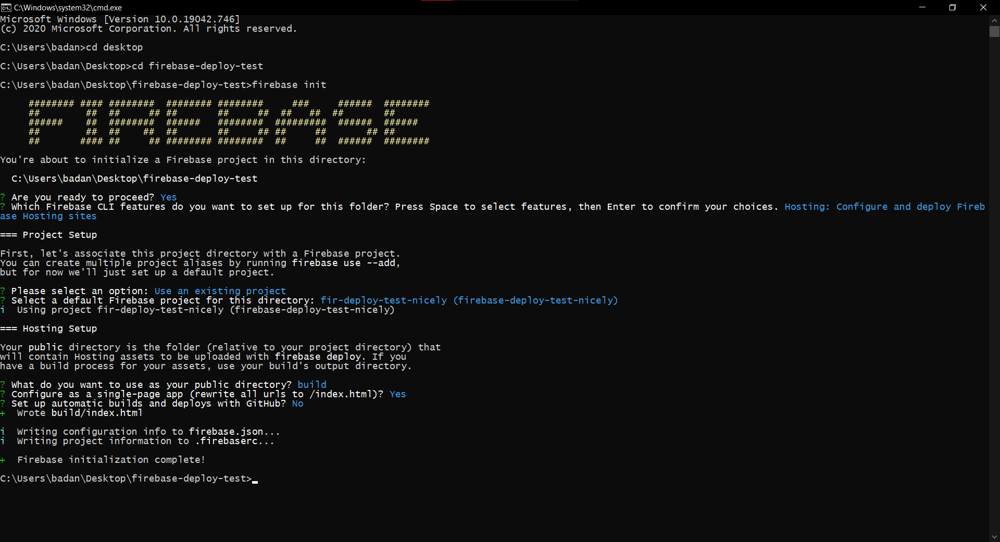
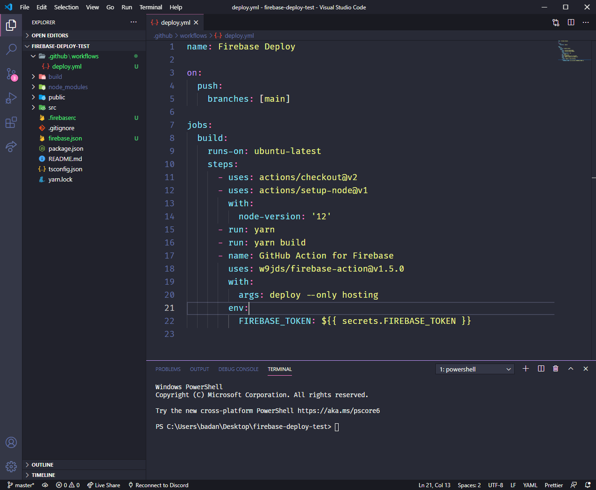
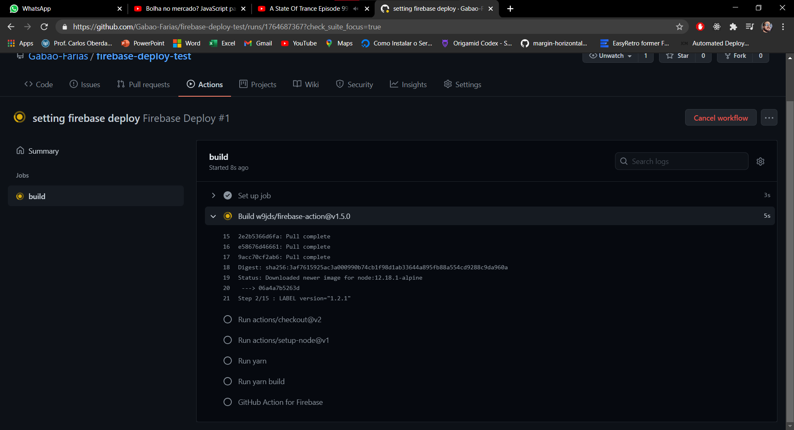
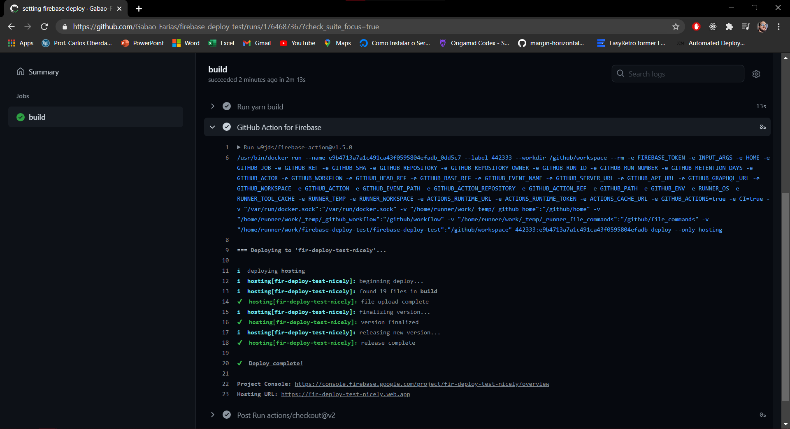

<div align="center">
  
  <h1>Automating the Deploy of a React App Using Firebase and Github Actions</h1>
</div>

## Step-by-step
Here we'll see a fast step-by-step tutorial, to deploy your react app.

### Make sure NPM and NPX are installed locally

If you don't have them, first install NPM by downloading Node.js.
After that, you can install NPX via CI, using:

`npm install -g npx`

### React App

Now you'll need a react app to deploy, and it could be a new app or one that you've been working a time ago.

In this case I'll create a new one using:

`npx create react-app my-app --template typescript`

### Starting Things on Firebase

So we got our app, and now we need to set things up in firebase and to get it started, navigate to [Firebase](https://firebase.google.com/) (create an account if you don't have it), and go to **console** and you will reach here...


...and here you'll create a new project, or add a new one if you already have other projects in there.

### Firebase CI

The project is created on Firebase, check!
Now in this step, we are going to automate the app push into Firebase, and we'll need a token that will authenticate our account when running the workflow.

For that, we'll need firebase-tools installed to proceed:

`npm install -g firebase-tools`

And to extract the token use:

`firebase login:ci`

After you select you account to login, a token must be provided on your terminal, you should keep this openned because we gonna need it in the next step.



### Storing Token in GitHub Secrets
We've got our token, check!
GitHub has a way to handle with secrets and those secrets can be easily used in workflows.
Now, to store those secrets:

* go to your repo settings
* then secrets
* then New repository secret
* and finally, add the name (FIREBASE_TOKEN for example...) and it value.



### Setting Firebase on App
Token stored on github secrets, check!
Now, back to the app's root directory, we'll start setting some Firebase files, using:

`firebase init`

This will open some options in the terminal:
* first select the **Hosting** option;
* select **Use an existing project**;
* then select the project you created in [this step](#starting-things-on-firebase) in Firebase;
* set the public directory as 'build' (it's the folder created by react scripts when building the app);
* finally you can set as a single page application;

> All this config can be resetted later...



### Workflow File
Have we got our *.firebaserc* and *firebase.json* set?! Yes, we have!
And now we'll need to get our YAML file, to automate our work.

So first of all, we're going to create a folder inside the root directory called *.github/workflows*, and in this folder is where our *.yml* file will be placed (it could be deploy.yml or whatever name...).

And now, paste the below code in this *.yml* file.

```yml
name: Firebase Deploy

on:
  push:
    branches: [main]

jobs:
  build:
    runs-on: ubuntu-latest
    steps:
      - uses: actions/checkout@v2
      - uses: actions/setup-node@v1
        with:
          node-version: '12'
      - run: yarn
      - run: yarn build
      - name: GitHub Action for Firebase
        uses: w9jds/firebase-action@v1.5.0
        with:
          args: deploy --only hosting
        env:
          FIREBASE_TOKEN: ${{ secrets.FIREBASE_TOKEN }}
```



It's a pretty simple and easy to understand code, the article taken as base to this one, explains the code in this way:

* The **name** of your workflow. It can be literally any string, although it’s a good idea (as always) to keep it relevant to what you’re doing.
* The **‘on’** field establishes the conditions on where your workflow is going to run. In this case, it is going to run every time there is a ‘push’ event related to the master branch of the repository.
* You can define any number of jobs below the **‘jobs’** field, and they’ll be executed in parallel or sequentially.
* **build** Name of the job. It can be any name.
* **runs-on** Defines in which kind of environment the job will run. It can be Windows Server 2019, Ubuntu (16.04, 18.04, or 20.04), or macOS Catalina 10.15.
* The **‘steps’** field lists any number of steps to be run in a job.
* **‘actions/checkout@v2’** is an action from the GitHub marketplace that will basically clone your repository into the workflow container and make it available for you to work with it.
* **‘actions/setup-node@v1’** is another action from the marketplace that sets up Node and NPM for you, so you don’t need to worry about installing them.
* **run: yarn** This will install all dependencies for your application, similar to what ‘npm install’ would do.
* **run: yarn build** This will execute a React script to build an optimized version on your application, and place all optimized files on a folder called ‘build’, which is the only thing we’ll be sending to Firebase Hosting (as per firebase.json config).
* **w9jds/firebase-action@v1.5.0** For this tutorial, we decided to use the action *‘w9jds/firebase-action@v1.5.0’*, available on the Actions Marketplace. This action will install firebase-tools and execute any command you like, which you have to pass as an argument to **‘with’**, with an **‘args’** key. In our case, all we want is to do a single deploy to Hosting, hence the *‘deploy — only hosting’*.
* For every step you can pass variables that will be set on the environment for the given step, being available for the commands being executed. In this case, the firebase-actions demands the Firebase token that we extracted above to be set as an environment variable, so we’re fulfilling that demand by referencing the secret we set earlier with the syntax ${{ secrets.<SECRET_NAME> }}.

For a deeper reference about the syntax of this code you can check on full reference: https://docs.github.com/en/actions/reference/workflow-syntax-for-github-actions

### Run it
Okay, now that we're all set, we must commit and push all changes in the main branch, and see the magic happening. In GitHub, you can check the logs by going into your project actions an there you can see GitHub Action for Firebase step an there you will find the URL that your app is on.



You can see the process occurring in execution-time and if everything runs with no errors, you should see the URL displayed in the logs.



## References
* https://levelup.gitconnected.com/how-to-deploy-a-react-app-to-firebase-using-github-actions-step-by-step-11367e0627d5

* https://docs.github.com/en/actions/reference/workflow-syntax-for-github-actions

* https://blog.tecsinapse.com.br/criando-uma-aplica%C3%A7%C3%A3o-react-firebase-passo-a-passo-9ebc5a8a442f
