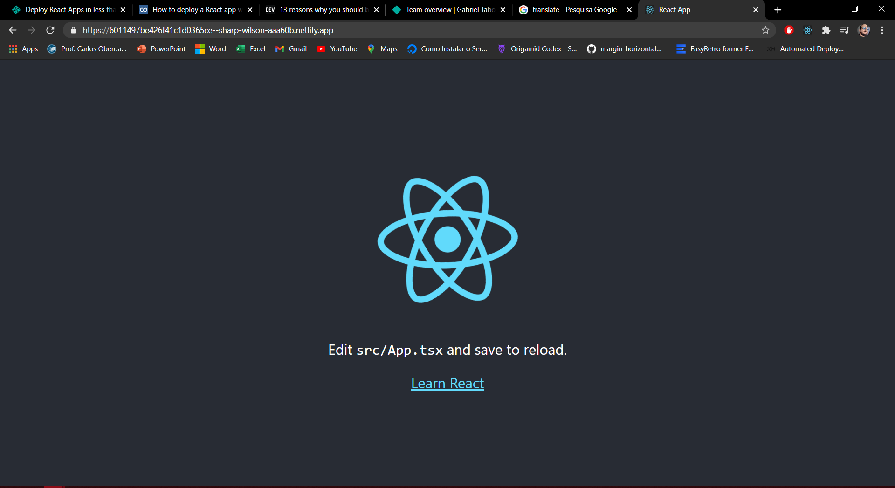

  
  <h1>Automating the Deploy of a React App Using Netlify</h1>

## React App
Ok so, first of all, create your React App, or take one that you already have on hands.

* Make sure you runned build before go to the next steps!

## Netlify CLI
Have we got our React App??? Sure we have! So now, we need to install netlify CLI tools:

* starting by the command `npm install netlify-cli -g`;

* In the article taken as base for this one, there is nothing sayin about staying in the root of the project but I'm assuming that this is a true (it worked for me anyway...)! So getting in the root, you will insert `netlify deploy`

  * this should open your browser in Netlify site to login;

  

* Authorize Netlify to access you github;

* As I will use CLI to set things up, you should authorize it either;

* Ok after the deploy your terminal should look like this;

* If you access the URL provided in the logs, you'll access a draft version of the deploy.

## Github
* Ok, move yourself to Github and create a new repo for this project;

## Netlify

* Head back to Netlify and get in the dashboard where you can see your projects and click on Site settings;

* In site settings click on link site to Git;

* I authorized access for only selected repos, but this decision is up to you;

* And after you installed netlify on github, back to netlify should appear a window to set publish directory, build command, probably these configs will be already correct, but... who knows how did you set up your React App right?!

* And finally everything is set up! If you push your changes to main branch it will automatically restart deploying a new version of the application containing the new changes

## References

* https://levelup.gitconnected.com/how-to-deploy-a-react-app-with-netlify-set-up-continuous-deployment-via-github-53859dcdaf40

* https://www.netlify.com/
